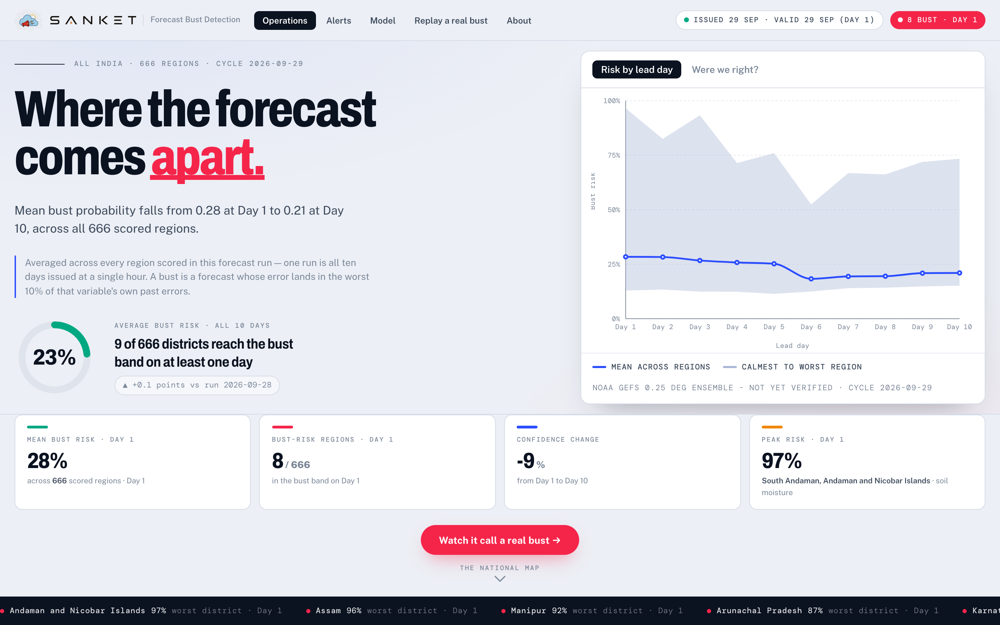
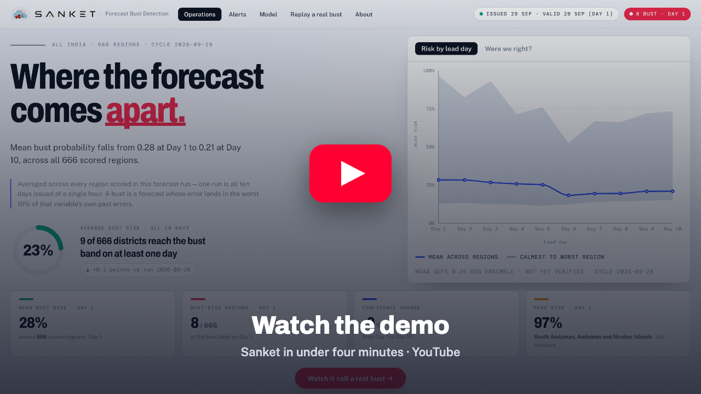
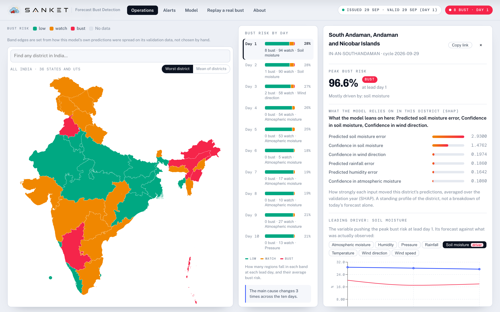
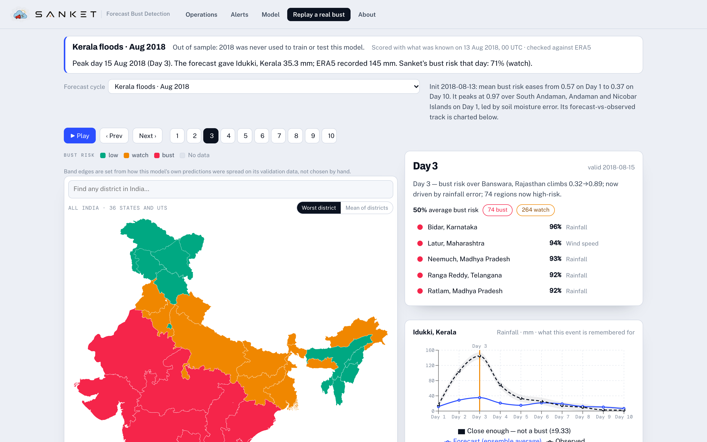
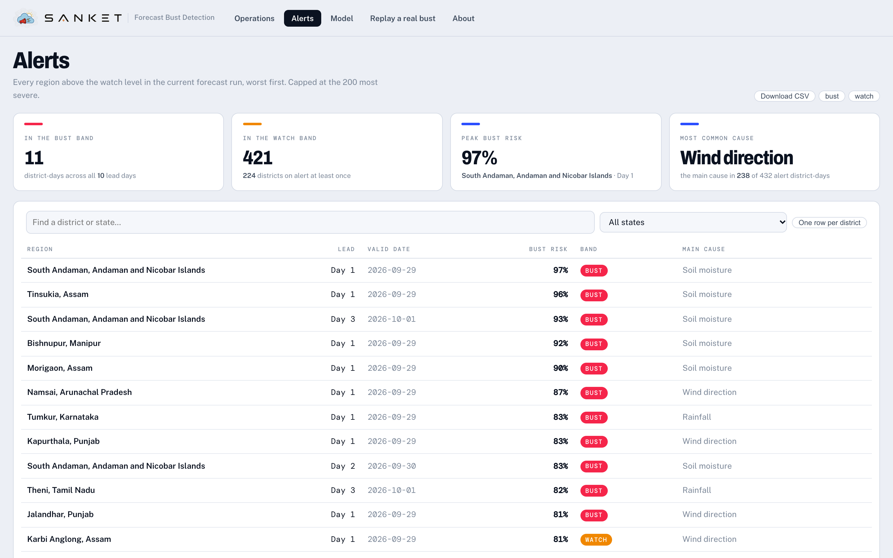
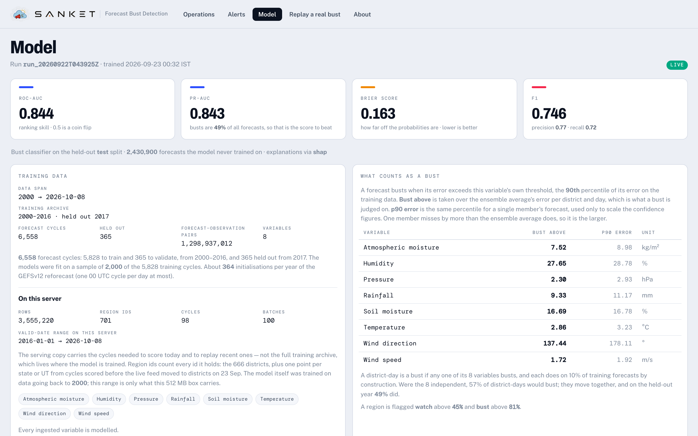
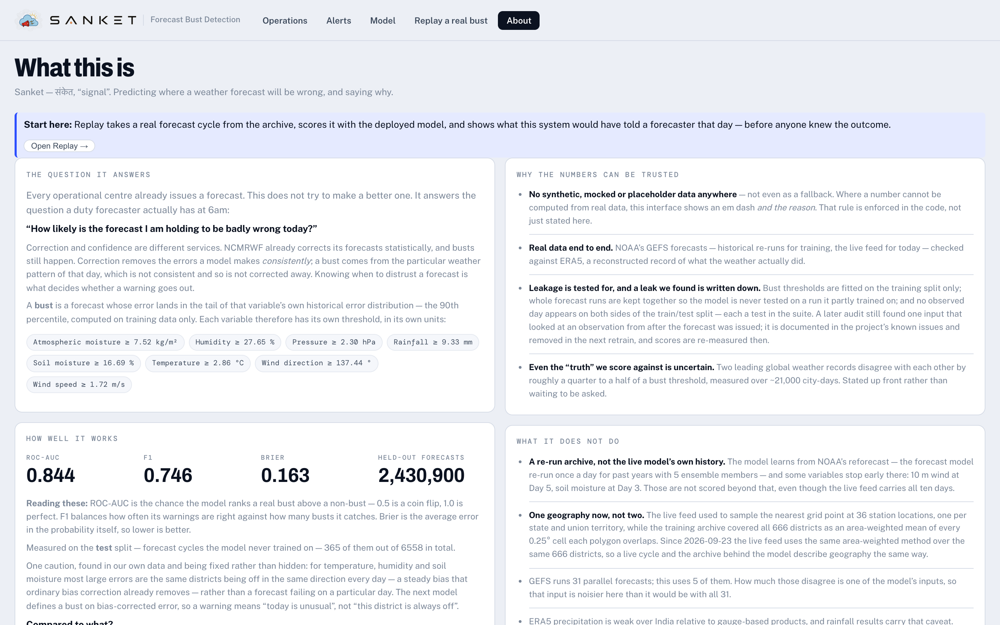

<div align="center">

<picture>
  <source media="(prefers-color-scheme: dark)" srcset="docs/images/logo-dark.svg">
  
</picture>

### Predicting where India's weather forecast will be wrong, and saying why.

Smart India Hackathon 2026 · Problem Statement **SIH26079** · Ministry of Earth Sciences

[](https://sanket-a0dd.onrender.com)
[](https://youtu.be/rY73m6pxdpE)

[](https://github.com/Bhushan2318/sih-main/actions/workflows/setup.yml)
[](https://github.com/Bhushan2318/sih-main/actions/workflows/refresh-data.yml)
[](LICENSE)


[Live site](https://sanket-a0dd.onrender.com) · [Demo video](https://youtu.be/rY73m6pxdpE) · [One-pager](docs/one-pager.md) · [Known issues](docs/known-issues.md) · [All docs](docs/README.md)

</div>



## Contents

- [The question it answers](#the-question-it-answers)
- [See it working](#see-it-working)
- [How it works](#how-it-works)
- [How well it works](#how-well-it-works)
- [Quick start](#quick-start)
- [Development](#development)
- [Deployment](#deployment)
- [Repository layout](#repository-layout)
- [Technology](#technology)
- [Data sources and licences](#data-sources-and-licences)
- [Limitations](#limitations)
- [Contributing](#contributing) · [Citation](#citation) · [Acknowledgements](#acknowledgements) · [Licence](#licence)

## The question it answers

Every operational centre already issues a forecast. Sanket does not try to make a better
one. It answers the question a duty forecaster actually has at 6am:

> **"How likely is the forecast I am holding to be badly wrong today?"**

A **bust** is a forecast whose error lands in the tail of that variable's own historical
error distribution: above the 90th percentile, computed on training data only. For each of
India's **666 districts**, **8 surface variables** and **lead days 1 to 10**, Sanket
predicts the probability of a bust, and attributes every prediction to the inputs that
drove it.

Correction and confidence are different services. NCMRWF already corrects its forecasts
statistically, and busts still happen. Correction removes the errors a model makes
*consistently*; a bust comes from the particular weather pattern of that day. Knowing
when to distrust a forecast is what decides whether a warning goes out.

**What it gives you**

- **A bust probability** for every district, variable and lead day, from the newest NOAA
  GEFS forecast, refreshed every six hours.
- **The reasons.** Each district's panel shows what drove its prediction, from SHAP over
  the XGBoost models.
- **The national picture.** The district map by lead day, the horizon rail, alerts ranked
  by risk, and ensemble divergence.
- **Replay of real events.** Kerala floods (2018), Mumbai rain (2017), Cyclone Ockhi
  (2017) and Cyclone Fani (2019), each scored as of issue time: what Sanket would have
  said before anyone knew the outcome.
- **Numbers you can check.** Real data only, held-out years, a ladder of baselines, and
  every known caveat written down.

## See it working

<a href="https://youtu.be/rY73m6pxdpE"></a>

<table>
<tr>
<td width="50%" valign="top"><br><b>Operations.</b> The district map for one lead day, the risk for every day on the horizon rail, and a district's panel with its peak risk and what drove it.</td>
<td width="50%" valign="top"><br><b>Replay a real bust.</b> A real past cycle, scored by the deployed model and stepped through day by day, with the forecast drawn against what was observed.</td>
</tr>
<tr>
<td valign="top"><br><b>Alerts.</b> Every district and day above the watch level, worst first, with its main cause. Filter by state, or download the list as CSV.</td>
<td valign="top"><br><b>Model.</b> The served run, its held-out scores, the data it was trained on and each variable's bust threshold, all read from the live model.</td>
</tr>
</table>

## How it works

1. **Forecasts.** NOAA GEFSv12: the reforecast archive (2000–2019, one 00 UTC cycle a day,
   5 ensemble members, 0.25°, Day 1–10) for training, and the operational feed for today.
   Only the GRIB2 messages that are needed are fetched, by HTTP range requests against each
   file's `.idx` index.
2. **Observations.** ERA5 reanalysis from the Copernicus Climate Change Service: from the
   Climate Data Store for the training years, and through Open-Meteo for recent days.
3. **Districts.** 666 districts from GADM 4.1, with three deliberate corrections: Ladakh
   reassigned out of Jammu & Kashmir, disputed-territory features kept and dissolved into
   their parent districts, and Delhi relabelled. Each district's value is the area-weighted
   mean of every 0.25° cell its polygon overlaps, not the nearest grid point: ten districts,
   among them Kolkata, Hyderabad, the Puducherry enclaves and Lakshadweep, contain no grid
   centre at all. Forecasts and observations go through the same single weight table.
4. **Features.** Ensemble spread and member count, run-to-run forecast jumps, a time-lagged
   ensemble, pressure and moisture tendencies, the concurrent forecasts of every other
   variable, the MJO state, district descriptors (location, area, elevation, distance from
   the border), season, and each district's historical bust frequency.
5. **Models.** One XGBoost regressor per variable predicts the size of the forecast's
   error. A bust classifier, trained on their out-of-fold predictions, turns those into a
   bust probability. A convolutional challenger over the full gridded fields is scored on
   the same rows. A promotion gate refuses any model that loses more than 0.05 ROC-AUC
   against the one being served, or scores below 0.55.
6. **Serving.** CI scores every cycle, computes its SHAP explanations and builds every
   dashboard response ahead of time. A 512 MB free-tier instance serves those files and the
   built dashboard from one origin, and never trains.

### System architecture

Raw forecasts and observations enter at the top left and run into the canonical store.
There the path splits: one branch trains, the other serves, and they never swap roles.

```
   SOURCES                    INGEST                      STORE
┌──────────────────┐    ┌────────────────────┐    ┌─────────────────────┐
│ NOAA GEFS        │    │ format-agnostic    │    │ canonical store     │
│  · NOMADS        │    │ parsers            │    │                     │
│    (India subset,│    │ SchemaMapper       │    │ hive-partitioned    │
│     last ~3 days)├───►│ district weights   ├───►│ Parquet             │
│  · AWS S3        │    │ (area means)       │    │ +                   │
│    (byte-ranged) │    │ completeness guard │    │ SQLite lineage      │
│                  │    │  → refuse, never   │    │                     │
│ ERA5             │    │    patch           │    │                     │
│  provisional     │    │                    │    │                     │
│  → final         │    │                    │    │                     │
└──────────────────┘    └────────────────────┘    └──────────┬──────────┘
                                                             │
                              ┌──────────────────────────────┴────┐
                              ▼                                   ▼
                  TRAIN — GPU workstation             SERVE — Render free
                  ┌───────────────────────┐           ┌──────────────────────┐
                  │ never serves          │           │ 512 MB · never trains│
                  │                       │           │                      │
                  │ error regressors      │  model    │ FastAPI              │
                  │ bust classifier       │  release  │ prebuilt responses   │
                  │ thresholds · SHAP     ├──────────►│ built SPA, one origin│
                  │ baseline ladder · gate│  artifact │ /api/*   /ws         │
                  └───────────────────────┘           └──────────┬───────────┘
                                                                 │
                                                                 ▼
                                                        React dashboard
                                                        map · detail · alerts
                                                        model · replay · about
```

**The split down the middle is the load-bearing decision.** The serving box has 512 MB and
is *killed*, not throttled, when it goes over. The model it serves is trained on seventeen
years of reforecasts, which needs a GPU and tens of gigabytes of memory, so it is trained
on a workstation and published as a release through the same promotion gate the pipeline
uses. CI can still train a smaller model on its own if no pinned model is published. The
serving process never trains, and a checksum step fails the run if training ever touches
the serving store.

## How well it works

**The live figures are served, not written here.** The deployed model reports them at
[`/api/model/status`](https://sanket-a0dd.onrender.com/api/model/status), and the site's
**Model** and **About** tabs render them beside the baseline ladder. A number copied into
a README is right until the next retrain and quietly wrong afterwards, which is the
failure this project exists to avoid. This README once had exactly that problem: it
claimed a ROC-AUC from a 17-cycle run long after the deployed model had moved on.

What is stable enough to write down is how the evidence is built:

- **Held-out years.** The served model trains on daily reforecast cycles for 2000–2016
  across all 666 districts and is tested on all of 2017, which it never saw. 2018 and 2019
  are the next evaluation.
- **Against what?** Every score sits beside seven baselines fitted on the same training
  rows and scored on the same held-out rows: climatology, lead day, ensemble spread, lead
  day with spread and season, EMOS, IDR and analogs.
- **Verification, done properly.** Brier skill score; ROC-AUC with a block bootstrap over
  whole forecast cycles; the binormal Z-AUC of Shanker, Sarkar & Mamgain (NCMRWF, QJRMS
  2024); the CORP reliability decomposition; SEDI; relative economic value; and conformal
  coverage measured on the test rows.
- **Leakage is tested for.** Bust thresholds are fitted on the training split only,
  out-of-fold folds are grouped by forecast cycle, and no observed day sits on both sides
  of the split. Each of those is enforced by a test.
- **What the tests missed is written down.** An audit on 2026-09-25 found two things that
  make the current held-out scores look better than live use. One input, the previous
  lead day's realised error, is something no live forecast can have. And the 2016–2017
  validation and test rainfall came from a one-day-late IMD file rather than ERA5. The
  measurements and the fixes are in [`docs/known-issues.md`](docs/known-issues.md). The
  next retrain removes the input, and promotion then compares the two models on the same
  terms.
- **The truth has error too.** Over 21,492 paired city-days, ERA5 and MERRA-2 disagree by
  24–43% of the bust threshold, depending on the variable. That is the floor under any
  label.

> Regressor error fell by about 17% on 2026-08-29 when a one-day misalignment was found and
> fixed. Lead day *k* was built from forecast hours ((k−1)·24, k·24] but labelled
> `valid_date = init + k`, so every forecast was checked against the next day's
> observation. The convention is now `valid_date = init + (lead − 1)`; see
> [`fix_forecast_valid_date_offset.py`](backend/scripts/fix_forecast_valid_date_offset.py).



## Quick start

You need **Python 3.11 or 3.12** (3.9 also works; 3.13 does not yet, because one pinned
dependency has no wheel for it) and **Node 18 or newer**. Everything installs from
prebuilt wheels, so no compiler is needed. Use `git clone` rather than GitHub's "Download
ZIP", which extracts as a doubled `sih-main-main/sih-main-main/` folder.

```bash
git clone https://github.com/Bhushan2318/sih-main.git
cd sih-main/backend
python3 -m venv .venv && source .venv/bin/activate
pip install -r requirements.txt
cp .env.example .env

# Load the real 2019 sample (GEFS reforecast + ERA5) and train on it
python -m app.ingestion.pipeline --file data/samples/gefs_reforecast_india_2019.parquet --confirm-all
python -m app.ingestion.pipeline --file data/samples/era5_observations_india_2019.parquet --confirm-all
ALLOW_LOCAL_RETRAIN=true python -m app.ml.train_pipeline

uvicorn app.main:app --reload --port 8000     # API docs at http://localhost:8000/docs
```

Then, in a second terminal:

```bash
cd sih-main/frontend
npm install
cp .env.example .env
npm run dev                                   # dashboard at http://localhost:5173
```

CI runs these same steps on clean Windows and Linux machines for every pull request, so if
the badge above is green, they work.

<details>
<summary><b>Windows (PowerShell)</b></summary>

```powershell
git clone https://github.com/Bhushan2318/sih-main.git
cd sih-main\backend
py -3.12 -m venv .venv
.\.venv\Scripts\Activate.ps1
pip install -r requirements.txt
Copy-Item .env.example .env
python -m app.ingestion.pipeline --file data/samples/gefs_reforecast_india_2019.parquet --confirm-all
python -m app.ingestion.pipeline --file data/samples/era5_observations_india_2019.parquet --confirm-all
$env:ALLOW_LOCAL_RETRAIN = "true"; python -m app.ml.train_pipeline
uvicorn app.main:app --reload --port 8000
```

Second terminal:

```powershell
cd sih-main\frontend
npm install
Copy-Item .env.example .env
npm run dev
```

If PowerShell refuses to run the activate script, run
`Set-ExecutionPolicy -Scope CurrentUser -ExecutionPolicy RemoteSigned` once. Or use
Command Prompt, where activation is `.venv\Scripts\activate.bat`, the variable is
`set ALLOW_LOCAL_RETRAIN=true` and the copy is `copy .env.example .env`. If you only have
Python 3.13, install 3.12 (`winget install Python.Python.3.12`) and build the venv with
`py -3.12`.

</details>

## Development

| Task | Command |
|---|---|
| Backend tests | `pip install -r requirements-dev.txt` once, then `python -m pytest -q` (in `backend/`) |
| Frontend tests | `npm test` (in `frontend/`) |
| Frontend lint and type-check | `npm run lint` and `npm run build` (in `frontend/`) |
| Full retrain | `ALLOW_LOCAL_RETRAIN=true python -m app.ml.train_pipeline` |
| Ingest any file | `python -m app.ingestion.pipeline --file <path> --confirm-all` |
| Rebuild the sample data | `python scripts/fetch_gefs_reforecast_sample.py`, then `python scripts/fetch_era5_observations.py` (needs `requirements-live.txt`) |

Two conventions worth knowing before you edit:

- **`frontend/src/api/types.ts` mirrors `backend/app/api/schemas.py` by hand.** There is no
  codegen step. Change a response shape and both files move together.
- **`theme.ts` mirrors the CSS custom properties in `styles.css`.** Recharts measures and
  interpolates real colour strings, so it cannot read `var(--blue)`. The duplication is
  deliberate and commented at both ends.

The rules every change follows (real data only, metrics served rather than written down,
refuse rather than patch) are in [CONTRIBUTING.md](CONTRIBUTING.md).

<details>
<summary><b>Live ingestion</b> (off by default)</summary>

Live ingestion pulls fresh NOAA GEFS cycles and Open-Meteo observations. It needs the GRIB2
decoder, which is a separate install so the 512 MB image never carries it:

```bash
pip install -r requirements.txt -r requirements-live.txt
python -m eccodes selfcheck        # should print "Your system is ready"
```

On **Windows** some `eccodes` wheels ship a broken definitions bundle (`Unable to find
boot.def`, `flex scanner error`). `requirements-live.txt` lists `ecmwflibs` first, which
supplies a working binary and definitions and usually fixes it. If `selfcheck` still fails,
use conda-forge (`conda install -c conda-forge eccodes python-eccodes`) or run the backend
under WSL2. The rest of the app (dashboard, scoring, Replay, CSV and Parquet upload) does
not need any of this.

Then turn it on and restart `uvicorn`:

```bash
echo "LIVE_INGEST_ENABLED=true" >> backend/.env            # macOS / Linux
```
```powershell
Add-Content backend\.env "LIVE_INGEST_ENABLED=true"        # Windows PowerShell
```

For a one-off pull without editing `.env`:
`curl -X POST "http://localhost:8000/api/ingest/run-cycle?wait=true"` (PowerShell:
`Invoke-RestMethod -Method Post "http://localhost:8000/api/ingest/run-cycle?wait=true"`).
See [`backend/app/live/README.md`](backend/app/live/README.md).

</details>

## Deployment

One free Render web service serves the API **and** the built dashboard from a single
origin: no CORS, no second service, no proxy. The image never trains.

```
GitHub Actions (every 6 h)                  Render Free (512 MB, serve only)
  restore the previous store                  docker build:
  install the pinned serving model              node   → builds the dashboard
  pull + verify the newest GEFS cycle           curl   → pulls the release asset
  score every cycle, build every response       python → serves API + SPA
  publish release `data-latest`    ───────►   runs `uvicorn app.main:app`
  POST the Render deploy hook      ───────►   redeploys; CI then warms it
```

**Deploy only through the workflow.** Actions → *Refresh model and data* (or
`gh workflow run refresh-data.yml --ref main`), never Render's *Deploy latest commit*.
The workflow packages every dashboard response for the code it deploys. A deploy from
Render's dashboard runs that code against the previous bundle, which does not match it,
so the box builds every screen live, one at a time, near its memory limit.
`/api/health` → `prebuilt.active` says which state it is in.

<details>
<summary><b>One-time setup</b></summary>

1. **Seed the first artifact.** The image pulls `data-latest`. Publish one from a machine
   that already has a trained model:

   ```bash
   cd backend
   python -m scripts.package_for_deploy /tmp/sanket-data.tar.gz
   gh release create data-latest /tmp/sanket-data.tar.gz \
     --title "Latest model and data" \
     --notes "Rolling artifact published by the refresh workflow."
   ```

   No `gh`? Build the tarball with the same command, then create the release in the web
   UI: **Releases → Draft a new release**, tag `data-latest`, and drag the file in. The
   packager ships only the *current* model run; taring `data/models` wholesale would grow
   the artifact on every refresh. Skip this step and the first build still succeeds: the
   site reports `model_trained: false` and shows its empty state until the workflow runs.

2. **Create the Render service.** New → Blueprint → point at this repo. It reads
   [`render.yaml`](render.yaml), so there is no console wiring to redo if the service is
   recreated.

3. **Wire the deploy hook.** Render → the service → Settings → Deploy Hook → copy the URL,
   then add it as the repository secret `RENDER_DEPLOY_HOOK` (Settings → Secrets and
   variables → Actions). Without it the workflow still publishes the artifact; only the
   automatic redeploy stops.

4. **Pin a model (optional).** `python -m scripts.publish_serving_model --run-id <run>`
   runs the promotion gate against the model the site serves, checks the API with the new
   model installed, and publishes it as the `serving-model` release. Every refresh then
   serves that model; deleting the release returns the pipeline to training its own.

5. **Keep it warm.** Render Free spins down after 15 minutes idle (a 30–50 s cold start).
   Point an external pinger (UptimeRobot, every 5 minutes) at `/api/health`. A browser tab
   will *not* work: polling pauses when the tab is in the background.

</details>

<details>
<summary><b>What the free tier costs you</b></summary>

| Limit | Effect | Handling |
|---|---|---|
| 512 MB RAM | cannot retrain | Actions and a workstation train; the upload panel is hidden via `VITE_ENABLE_UPLOAD=false` |
| no WebSocket | no live push | the client falls back to 60 s polling and reports the socket closed |
| spins down at 15 min | 30–50 s cold start | external pinger on `/api/health` |
| 750 instance-hours a month | about one always-on service | fine for a single service |

</details>

<details>
<summary><b>Running the refresh by hand, and testing the deployed shape locally</b></summary>

Actions → **Refresh model and data** → *Run workflow*. `force_train` retrains even with no
newly verified rows; `skip_forecast` retrains on what is already stored. Locally:

```bash
cd backend
python -m scripts.refresh_for_deploy --help
```

The image builds the dashboard into `backend/app/static`, which `app/main.py` mounts only
if it exists. So this reproduces production without Docker, and removing the directory
restores normal split-process development:

```bash
cd frontend && VITE_ENABLE_UPLOAD=false npm run build
cp -r dist ../backend/app/static
cd ../backend && ./.venv/bin/python -m uvicorn app.main:app --port 8000
# http://localhost:8000 now serves the whole product from one origin
rm -rf app/static      # back to normal development
```

</details>

## Repository layout

Two deployables in one repository, plus the workflows that join them. There is no shared
package and no build orchestrator: the frontend compiles to static files that the backend
image copies in, which is why one process can serve both from a single origin.

```
sih-main/
├── backend/                  FastAPI service: API, ML, ingestion, storage
│   ├── app/
│   │   ├── api/              routers + Pydantic response schemas (the contract)
│   │   ├── db/               SQLAlchemy models, session, CRUD: lineage and metadata
│   │   ├── features/         feature engineering, pivot to forecast-event grain
│   │   ├── ingestion/        parsers, SchemaMapper, canonical schema, pipeline
│   │   ├── live/             NOAA GEFS feed, observations, scheduler, orchestrator
│   │   ├── ml/               regressors, classifier, thresholds, SHAP, registry, CNN
│   │   ├── realtime/         WebSocket broadcaster + typed retrain events
│   │   ├── services/         read-side logic behind each router, prebuilt responses
│   │   ├── storage/          hive-partitioned Parquet store
│   │   ├── utils/            district geometry and weights, India state codes
│   │   ├── config.py         env-driven settings (pydantic-settings)
│   │   ├── contracts.py      frozen shapes shared across the codebase
│   │   └── main.py           app assembly, lifespan, static SPA mount
│   ├── data/                 real samples and reference tables; store and runs gitignored
│   ├── scripts/              fetch, backfill, training, packaging, publishing
│   └── tests/                pytest suite, run against real sample files
├── frontend/                 React + Vite + TypeScript dashboard
│   └── src/
│       ├── api/              typed fetch clients, mirroring backend/app/api/schemas.py
│       ├── components/       about · alerts · common · dashboard · detail
│       │                     map · model · replay · upload
│       ├── hooks/            TanStack Query hooks, live socket, media queries
│       ├── pages/            DashboardPage, the tab shell
│       ├── store/            Zustand store for live events
│       ├── styles.css        the entire design system, hand-written
│       └── theme.ts          chart palette, mirroring the CSS tokens
├── docs/                     one-pager, known issues, reviews and plans (index: docs/README.md)
├── .github/                  CI and refresh workflows, issue and pull-request templates
├── Dockerfile                one image: builds the SPA, pulls the model, serves both
└── render.yaml               service definition, so the host is not hand-wired
```

## Technology

| Layer | Choice | Why this one |
|---|---|---|
| API | **FastAPI** + **uvicorn** | Typed request and response models double as the OpenAPI contract |
| Validation | **Pydantic v2**, **pydantic-settings** | Response shapes are schemas, so an empty state cannot silently become a placeholder |
| ML | **XGBoost**, **scikit-learn**, **SHAP** | Gradient boosting on tabular features; SHAP is computed ahead of time, never on the request path |
| Challenger | **PyTorch**, exported to **ONNX** | A dilated CNN over the gridded fields, scored against XGBoost on the same rows; kept out of the serving image (`requirements-train.txt`) |
| Data | **pandas**, **NumPy**, **PyArrow** | Arrow column projection is what keeps scoring inside the memory budget |
| Storage | **Parquet** (hive-partitioned) + **SQLite** via **SQLAlchemy 2** | Columnar for analytical reads; SQLite holds lineage and run history, not measurements |
| Geo | **Shapely** (STRtree), **d3-geo**, **topojson-client** | Area weights server-side; TopoJSON keeps the map payload small |
| Schema mapping | **RapidFuzz** | Confidence-scored column matching, so arbitrary CSV and XLSX uploads map to the canonical schema |
| Realtime | **websockets** | Typed retrain events; the client falls back to polling where the host cannot proxy them |
| UI | **React 18**, **TypeScript 5.5**, **Vite 5** | One single-page app, built to static files |
| UI state | **TanStack Query 5**, **Zustand 4** | Query owns server state and cache invalidation; Zustand holds only live-socket events |
| Charts | **Recharts 2** | Composable SVG charts that take the design system's colours |
| Styling | **Hand-written CSS**, one `styles.css` | No framework: the design system is tokens and components, versioned as source |
| Tests | **pytest**, **httpx**, **vitest** | Run against real sample files; nothing fabricates a measurement |
| Live feed *(optional)* | **eccodes** / **ecmwflibs**, **cfgrib**, **xarray** | GRIB2 decoding, kept out of `requirements.txt` so the 512 MB image never installs it |
| Infra | **Docker**, **Render** free tier, **GitHub Actions**, **GitHub Releases** | Releases are the model artifact store, so there is no object storage to pay for |

Every core dependency installs as a **prebuilt wheel** on Windows, macOS and Linux; a plain
`pip install -r requirements.txt` never invokes a compiler. Total hosting cost: **$0**.

## Data sources and licences

Everything Sanket shows traces back to one of these sources. The MIT licence covers this
repository's **code** only; each dataset keeps its own terms.

| Source | Used for | Terms |
|---|---|---|
| [NOAA GEFSv12 reforecast](https://registry.opendata.aws/noaa-gefs-reforecast/) | Training forecasts, 2000–2019 | Public domain (NOAA Open Data) |
| NOAA GEFS operational feed (NOMADS, AWS) | Live forecasts | Public domain |
| [ERA5](https://cds.climate.copernicus.eu/) (Copernicus C3S) | Observations for training and verification | CC-BY 4.0 |
| [Open-Meteo Historical Weather API](https://open-meteo.com/) | ERA5 observations for recent days | CC-BY 4.0 |
| [GADM 4.1](https://gadm.org/) | District boundaries, for aggregation and the map | Free for academic and other non-commercial use; redistribution or commercial use needs GADM's prior permission |
| [Natural Earth](https://www.naturalearthdata.com/) | Claimed-territory outlines on the map | Public domain |
| [IMD gridded rainfall](https://imdpune.gov.in/cmpg/Griddata/rainfall.php) | Rainfall in some held-out years (see known issues); the planned rainfall truth | India Meteorological Department terms |
| [NOAA PSL MJO index (OMI)](https://psl.noaa.gov/mjo/mjoindex/) | MJO features | NOAA, public |
| CGIAR-CSI SRTM 250 m, via [Open-Elevation](https://open-elevation.com/) | District elevation | See the providers' terms |
| MERRA-2 (NASA GMAO), [NASA POWER](https://power.larc.nasa.gov/) | Measuring the ground truth's own uncertainty | NASA open data |

Using boundary data for a political map of India raises its own questions, separate from
licensing: India's 2021 geospatial guidelines name Survey of India data as the standard.
The full review, with sources, is in
[`docs/boundary-geometry-licensing.md`](docs/boundary-geometry-licensing.md). Please read it
before reusing the map geometry.

## Limitations

Stated plainly, because a reader should hit these before drawing conclusions.

- **One held-out year.** The served model trains on daily reforecast cycles for 2000–2016
  and is tested on 2017 only, one monsoon. 2018 and 2019 are in the archive, unused by the
  model, and are the next evaluation.
- **Most "busts" in some variables are steady bias.** For temperature, humidity and soil
  moisture, most large errors come from districts that are off the same way every day,
  which ordinary bias correction removes. The next retrain defines busts on bias-corrected
  error.
- **Some variables stop early in the training archive:** 10 m wind at Day 5 and soil
  moisture at Day 3. They are not scored beyond that on the live feed.
- **5 of 31 GEFS ensemble members**, so spread-derived features are a noisy estimate of
  the true ensemble spread. The reforecast archive only has 5 members a day.
- **ERA5 precipitation is weak over India** compared with gauge-based gridded products, and
  rainfall carries that caveat. Rainfall is also the hardest variable here: zero-inflated
  and heavily skewed.
- **The ground truth has its own error.** Two leading reanalysis products disagree by
  roughly a quarter to a half of a bust threshold. That is the irreducible uncertainty in
  the label itself.
- **"Bust" is defined on surface-variable error**, not the synoptic criterion of Rodwell et
  al. (2013), a Z500 anomaly correlation below 0.4 at Day 6. This is deliberate: surface
  error is what reaches agriculture and disaster response, whereas Z500 is what reaches
  meteorologists.
- **The serving instance has 512 MB and cannot train.** It carries only the cycles it
  needs to score and replay. The site reports its training data and its served data
  separately rather than conflating them.

**What would make this conclusive.** The gaps are known, not vague: the full 31-member
operational ensemble instead of five; IMDAA and IMD gauge-based gridded rainfall as
observations alongside ERA5; the synoptic Z500 bust definition reported beside the
surface-error one; and more held-out years. Every open caveat, with what was measured, is
in [`docs/known-issues.md`](docs/known-issues.md).

## Contributing

Contributions are welcome. [CONTRIBUTING.md](CONTRIBUTING.md) sets out the rules that keep
the numbers honest (real data only, metrics served rather than written down, measure
rather than estimate) and how a change gets merged. Please report security problems
privately, as described in [SECURITY.md](SECURITY.md). Everyone taking part follows the
[Code of Conduct](CODE_OF_CONDUCT.md).

## Citation

If you use Sanket or build on it, please cite it. GitHub's **Cite this repository** button
reads [`CITATION.cff`](CITATION.cff).

## Acknowledgements

- The problem statement: the **Ministry of Earth Sciences**, for Smart India Hackathon
  2026.
- The data: **NOAA** (GEFSv12, the MJO index), the **Copernicus Climate Change Service**
  (ERA5), **GADM**, the **India Meteorological Department**, **NASA** (MERRA-2 and POWER),
  **Natural Earth**, **CGIAR-CSI** and **Open-Meteo**.
- The methods: Shanker, Sarkar & Mamgain (NCMRWF, QJRMS 2024) for the binormal Z-AUC and
  relative economic value; Dimitriadis, Gneiting & Jordan (2021) for CORP reliability;
  Ferro & Stephenson (2011) for SEDI; and Rodwell et al. (2013) for the synoptic view of
  forecast busts.

Built by **Team Winging It**. How the project was built, phase by phase, is in
[`docs/project-history.md`](docs/project-history.md).

## Licence

The code is released under the [MIT Licence](LICENSE). Data keeps its own terms; see
[Data sources and licences](#data-sources-and-licences).
